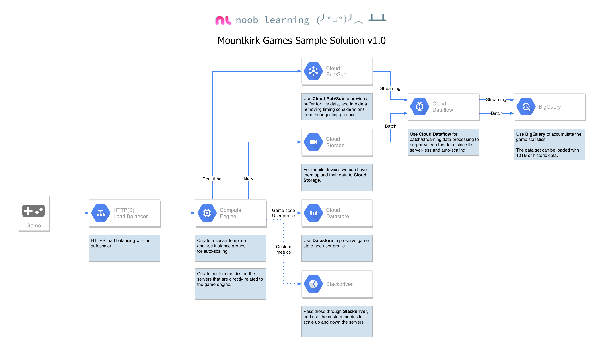

# Mountkirk Games Case Study
> https://cloud.google.com/certification/guides/cloud-architect/casestudy-mountkirkgames-rev2
## Company Overview
Mountkirk Games makes online, session-based, multiplayer games for mobile platforms. They build all of their games using some server-side integration. Historically, they have used cloud providers to lease physical servers.

Due to the unexpected popularity of some of their games, they have had problems scaling their global audience, application servers, MySQL databases, and analytics tools.

Their current model is to write game statistics to files and send them through an ETL tool that loads them into a centralized MySQL database for reporting.

## Solution Concept
Mountkirk Games is building a new game, which they expect to be very popular. They plan to deploy the game’s backend on Google Compute Engine so they can capture streaming metrics, run intensive analytics, and take advantage of its autoscaling server environment and integrate with a managed NoSQL database.

## Business Requirements

- Increase to a global footprint
- Improve uptime - downtime is loss of players
- Increase efficiency of the cloud resources we use
- Reduce latency to all customers

## Technical Requirements
### Requirements for Game Backend Platform

- Dynamically scale up or down based on game activity.
- Connect to a transactional database service to manage user profiles and game state.
- Store game activity in a timeseries database service for future analysis.
- As the system scales, ensure that data is not lost due to processing backlogs.
- Run hardened Linux distro.

### Requirements for Game Analytics Platform

- Dynamically scale up or down based on game activity.
- Process incoming data on the fly directly from the game servers.
- Process data that arrives late because of slow mobile networks.
- Allow queries to access at least 10 TB of historical data.
- Process files that are regularly uploaded by users’ mobile devices.

## Executive Statement
Our last successful game did not scale well with our previous cloud provider, resulting in lower user adoption and affecting the game’s reputation. Our investors want more key performance indicators (KPIs) to evaluate the speed and stability of the game, as well as other metrics that provide deeper insight into usage patterns so we can adapt the game to target users. Additionally, our current technology stack cannot provide the scale we need, so we want to replace MySQL and move to an environment that provides autoscaling, low latency load balancing, and frees us up from managing physical servers.

---

# Exams
## Question 1
#### For this question, refer to the Mountkirk Games case study.
Mountkirk Games wants you to design their new testing strategy. How should the test coverage differ from their existing backends on the other platforms?

- [ ] A. Tests should scale well beyond the prior approaches.
- [ ] B. Unit tests are no longer required, only end-to-end tests.
- [ ] C. Tests should be applied after the release is in the production environment.
- [ ] D. Tests should include directly testing the Google Cloud Platform (GCP) infrastructure.

ANSWER
<b>

C. Tests should be applied after the release is in the production environment.

</b>

---
## Question 2
#### For this question, refer to the Mountkirk Games case study
Mountkirk Games has deployed their new backend on Google Cloud Platform (GCP). You want to create a thorough testing process for new versions of the backend before they are released to the public. You want the testing environment to scale in an economical way. How should you design the process?

- [ ] A. Create a scalable environment in GCP for simulating production load.
- [ ] B. Use the existing infrastructure to test the GCP-based backend at scale.
- [ ] C. Build stress tests into each component of your application using resources internal to GCP to simulate load.
- [ ] D. Create a set of static environments in GCP to test different levels of load for example, high, medium, and low.

ANSWER
<b>

B. Use the existing infrastructure to test the GCP-based backend at scale.

</b>

---
## Question 3
#### For this question, refer to the Mountkirk Games case study.
Mountkirk Games wants to set up a continuous delivery pipeline. Their architecture includes many small services that they want to be able to update and roll back quickly. Mountkirk Games has the following requirements:
- Services are deployed redundantly across multiple regions in the US and Europe.
- Only frontend services are exposed on the public internet.
- They can provide a single frontend IP for their fleet of services.
- Deployment artifacts are immutable. Which set of products should they use?  
> 
- [ ] A. Google Cloud Storage, Google Cloud Dataflow, Google Compute Engine
- [ ] B. Google Cloud Storage, Google App Engine, Google Network Load Balancer
- [ ] C. Google Container Registry, Google Container Engine, Google HTTP(s) Load Balancer
- [ ] D. Google Cloud Functions, Google Cloud Pub/Sub, Google Cloud Deployment Manager

ANSWER
<b>

C. Google Container Registry, Google Container Engine, Google HTTP(s) Load Balancer

</b>

---
## Question 4
#### For this question, refer to the Mountkirk Games case study. Mountkirk Games' gaming servers are not automatically scaling properly. Last month, they rolled out a new feature, which suddenly became very popular. A record number of users are trying to use the service, but many of them are getting 503 errors and very slow response times. What should they investigate first?

- [ ] A. Verify that the database is online.
- [ ] B. Verify that the project quota hasn't been exceeded.
- [ ] C. Verify that the new feature code did not introduce any performance bugs.
- [ ] D. Verify that the load-testing team is not running their tool against production.

ANSWER
<b>

A. Verify that the database is online.

</b>

---
## Question 5
#### For this question, refer to the Mountkirk Games case study. Mountkirk Games needs to create a repeatable and configurable mechanism for deploying isolated application environments. Developers and testers can access each other's environments and resources, but they cannot access staging or production resources. The staging environment needs access to some services from production. What should you do to isolate development environments from staging and production?

- [ ] A. Create a project for development and test and another for staging and production.
- [ ] B. Create a network for development and test and another for staging and production.
- [ ] C. Create one subnetwork for development and another for staging and production.
- [ ] D. Create one project for development, a second for staging and a third for production.

ANSWER
<b>

A. Create a project for development and test and another for staging and production.

</b>

---
## Question 6
#### For this question, refer to the Mountkirk Games case study. 
Mountkirk Games wants to set up a real-time analytics platform for their new game. The new platform must meet their technical requirements. Which combination of Google technologies will meet all of their requirements?

- [ ] A. Container Engine, Cloud Pub/Sub, and Cloud SQL
- [ ] B. Cloud Dataflow, Cloud Storage, Cloud Pub/Sub, and BigQuery
- [ ] C. Cloud SQL, Cloud Storage, Cloud Pub/Sub, and Cloud Dataflow
- [ ] D. Cloud Dataproc, Cloud Pub/Sub, Cloud SQL, and Cloud Dataflow
- [ ] E. Cloud Pub/Sub, Compute Engine, Cloud Storage, and Cloud Dataproc

ANSWER
<b>

B. Cloud Dataflow, Cloud Storage, Cloud Pub/Sub, and BigQuery

</b>

---
# References
> https://cloud.google.com/solutions/mobile/mobile-gaming-analysis-telemetry
#### Figure 1: Game telemetry reference architecture

#### Figure 2: Real-time processing of events from game clients and game servers

---
# Compilation
